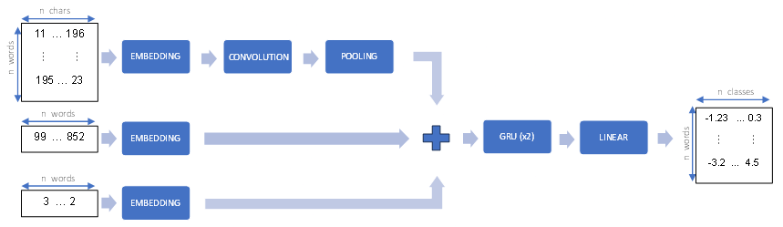

# DAGPap24: Detecting automatically generated scientific papers

This repository holds the 3rd place solution in the [DAGPap24](https://www.codabench.org/competitions/2431/) competition hosted on Cadabench. This competition aims to encourage the development of AI-generated scientific text detection systems. Basically, scientific papers were tokenized and the competitors had to classify each token into one of 4 classes. Solutions were evaluated using the F1-score.

## Environment Setup

First, clone the repository:
```sh
git clone https://github.com/thetourney/dagpap24.git
cd dagpap24
```

Check that the needed packages are installed (cf. `requirements.txt`) or create a new environment and install the packages. For example, with Conda:
```sh
conda create -n dagpap24 python=3.12 pip
conda activate dagpap24
pip install -r requirements.txt
```

## Predictions

Predictions can be done using the `src/test.py` program. The input must be a Parquet file containing a column named `tokens`. Each row of this column holds a list of tokens. 

Let's assume you got access to the test file supplied by the competition organizer and you saved it as `data/test_data.parquet`. You can reproduce the results submitted during the competition with the following command:
```sh
python src/test.py --data-path data/test_data.parquet --cfg-path config/cfg.json --model-path checkpoint/model.pt --preprocessor-path checkpoint/preprocessor.pickle --output-path predictions.parquet
```

Full usage message:
```sh
usage: test.py [-h] --data-path DATA_PATH --cfg-path CFG_PATH --model-path
               MODEL_PATH --preprocessor-path PREPROCESSOR_PATH --output-path
               OUTPUT_PATH

Make predictions from input file.

options:
  -h, --help            show this help message and exit
  --data-path DATA_PATH
                        Path to the Parquet file containing the test data.
  --cfg-path CFG_PATH   Path to the JSON file containing the training
                        configuration.
  --model-path MODEL_PATH
                        Path to the model checkpoint.
  --preprocessor-path PREPROCESSOR_PATH
                        Path to the preprocessor.
  --output-path OUTPUT_PATH
                        Path where the predictions will be saved.

```

## Training

The `src/train.py` program expects two inputs:
- the training data as a Parquet file with a column named `tokens`
- the model configuration as a Json file (check `config/cfg.json` for reference)

It will produce two outputs:
- the model parameters (aka state_dict)
- the preprocessor, used to convert a list of tokens into model inputs

Assuming you placed the `train_data.parquet` file supplied by the competition organizer in the `data` folder, you can generate the model used in the competition with the following command:
```sh
python src/train.py --data-path data/train_data.parquet --cfg-path config/cfg.json --model-path checkpoint/model.pt --preprocessor-path checkpoint/preprocessor.pickle
```

By default, the program follows the [Pytorch reproducibility](https://pytorch.org/docs/stable/notes/randomness.html) guide. If you use this program on a custom dataset and do not want to make the results reproducible, use the appropriate flag.

```sh
usage: train.py [-h] --data-path DATA_PATH --cfg-path CFG_PATH
                [--no-reproducibility NO_REPRODUCIBILITY] --model-path
                MODEL_PATH --preprocessor-path PREPROCESSOR_PATH

Train the model.

options:
  -h, --help            show this help message and exit
  --data-path DATA_PATH
                        Path to the Parquet file containing the training data.
  --cfg-path CFG_PATH   Path to the JSON file containing the training
                        configuration.
  --no-reproducibility NO_REPRODUCIBILITY
                        Do not try to make the results reproducible.
  --model-path MODEL_PATH
                        Path where the model will be saved.
  --preprocessor-path PREPROCESSOR_PATH
                        Path where the preprocessor will be saved.

```

## Checkpoints

The checkpoint folder contains the parameters of the model (`model.pt`) and the preprocessor (`preprocessor.pickle`) used during the competition.

## About the model

The tokens go through a preprocessing step which produces 3 tensors:

- the tokens are lowercased, then stripped of punctuation (if the output string contains only alphabetical characters) and finally mapped to integers.
- each character of the lowercased token is mapped to an integer.
- each token is also mapped to an integer indicating whether the original token is numeric, uppercase, lowercase, titlecase or none of the previous.

The three model inputs are used to generate 3 embeddings. The character-level embeddings are given to a single convolution block. This block contains a 1D convolution followed by Layer Normalization and a GELU activation. The character-level embeddings are max-pooled to give additional token-level embeddings. The three types of embeddings are summed. The result is fed into a block of bidirectional GRU layers. The outputs of the last recurrent layer are projected to the required number of classes by a linear layer.


